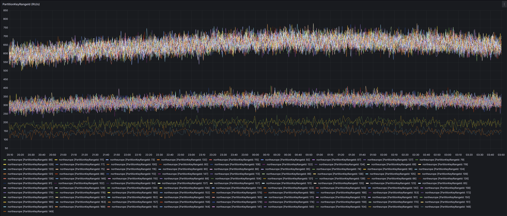

# modelRoutingRequests Container Migration

## 1. Summary

Migrate the `modelRoutingRequests` Cosmos DB container to a new `modelRoutingRequestsV2` container. The migration has three main goals:

1. **Change the partition key path from `/scenarioId` to `/id`** — today `ScenarioId` stores a random `requestId` rather than a scenario name, forcing a redundant `Scenario` field as a workaround. Using `/id` as the partition key lets `ScenarioId` carry the actual scenario name and eliminates the `Scenario` field.

2. **Reduce physical partitions from 100 to 32** — at ~18% RU utilization per partition, the current container is significantly over-provisioned. 32 partitions (320,000 RU/s autoscale max) is sufficient for the current load. This reduces the aggregator query pressure by ~3×: the aggregator fans out one feed-range query per physical partition on every polling cycle, so fewer partitions means fewer parallel Cosmos queries per cycle.

3. **Ensure even hash space distribution across physical partitions** — the current container was scaled up non-uniformly, leaving some partitions carrying 4.5× the load of others. By provisioning the new container at a power-of-2 throughput boundary (320,000 RU/s = 32 partitions) and following the Cosmos DB [best practice](https://learn.microsoft.com/en-us/azure/cosmos-db/scaling-provisioned-throughput-best-practices) of doubling at each step, all physical partitions receive an equal share of the hash space from the start.

---

## 2. Background

### 2.1 Problems with the Current Container

| Problem | Detail |
|---------|--------|
| **Uneven partition distribution** | The container was initialized at 200,000 RU/s and later scaled up to 1,000,000 RU/s without following Cosmos DB's [best practice of doubling throughput at each scale step](https://learn.microsoft.com/en-us/azure/cosmos-db/scaling-provisioned-throughput-best-practices). This left the hash space unevenly split across physical partitions. Request counts per partition are heavily skewed — 62 partitions carry roughly twice the load of the remaining 38. See distribution below. |
| **Over-provisioned partitions** | 100 physical partitions at ~18% RU utilization each. The aggregator fans out one feed-range query per partition on every polling cycle — 32 partitions is sufficient for current load, cutting aggregator query pressure by ~3×. |
| **Workaround overhead** | To avoid hot partitions, `Id` is assigned to `ScenarioId` as the partition key value, pushing the actual scenario name into a separate `Scenario` field. This workaround cascades into two costs: (1) the `Scenario` field is redundant once `ScenarioId` can carry the scenario name again; (2) a second composite index `(/scenario, /endpoint)` is needed for the usage aggregation query alongside the existing `(/scenarioId, /endpoint)` index — both exist only because of the field split. Migrating to `/id` as the partition key eliminates the workaround, removes the `Scenario` field, and drops the redundant index, reducing write RU on every upsert. |

**Observed production RU consumption for the 100 physical partitions:**



| Load tier | Partition count | Relative load |
|-----------|----------------:|---------------|
| Very High | 62 | 4.5× |
| High | 32 | 2.2× |
| Medium | 2 | 2.1× |
| Low | 2 | 1.3× |
| Very Low | 2 | 1× (baseline) |

The Very High tier (62 partitions) is carrying ~2× the load of the High tier (32 partitions). This imbalance is a direct consequence of the non-doubling scale-up history and cannot be corrected without recreating the container.

### 2.2 Why a New Container

Cosmos DB does not allow changing the partition key path of an existing container, and there is no way to rebalance the hash space of an existing container once it has been split unevenly. A new container is the only way to get a clean, evenly distributed hash space across physical partitions from the start.

---

## 3. Requirements

1. **New container** — `modelRoutingRequestsV2` with partition key path `/id`. Autoscale max set to a power-of-2 multiple of 10,000 RU/s per environment (32 partitions in production), ensuring even hash space distribution from the start.
2. **No interface changes** — `IModelRoutingStorageProvider` is unchanged.
3. **No new provider class** — V2 logic lives inside the existing `ModelRoutingStorageProvider`, branching on a runtime option.
4. **Runtime switch** — `UseV2Container` in `ModelRoutingOptions`, updatable via Azure App Configuration without redeployment. Enables rollout per environment and instant rollback by toggling the flag.
5. **Post-migration cleanup** — a follow-up cleanup PR removes all V1 branching, the `Scenario` field, and the old container once V2 is stable everywhere.

---

## 4. Design

### 4.1 New Container

**Container configuration:**

| Property | Value |
|----------|-------|
| Name | `modelRoutingRequestsV2` |
| Partition key path | `/id` |
| Default TTL | 300 s |
| Physical partitions | 32 (autoscale max = 320,000 RU/s in production) |

**Autoscale max RU/s by environment:**

| Environment | Max RU/s | Physical partitions |
|-------------|----------|---------------------|
| Production | 320,000 | 32 |
| Production Health | 40,000 | 4 |
| Staging | 40,000 | 4 |
| Production China | 80,000 | 8 |

> Cosmos DB allocates one physical partition per 10,000 RU/s of max autoscale throughput. All throughput values are chosen as multiples of 10,000 × a power of 2, ensuring physical partition counts are always a power of 2 (4, 8, 16, 32, …). This follows the [Cosmos DB scaling best practice](https://learn.microsoft.com/en-us/azure/cosmos-db/scaling-provisioned-throughput-best-practices) of doubling at each scale step, which guarantees even hash space distribution across all physical partitions — the violation of this rule is precisely what caused the skewed distribution in the current container.

**Indexing policy:**

- Excluded paths: `/*`, `/_etag/?`
- Included paths: `/endpoint/?`
- Composite indexes: `[/scenarioId ASC, /endpoint ASC]`

In V2 documents `ScenarioId` carries the actual scenario name, so this composite index directly supports the usage aggregation query.

### 4.2 Document Shape

The external record is structurally unchanged during the migration — `Scenario` is retained so one type works for both containers. Only the *values* written into `ScenarioId` and `Scenario` change:

| Field | V1 document | V2 document |
|-------|-------------|-------------|
| `Id` | Random `PicassoId` | Random `PicassoId` (unchanged) |
| `ScenarioId` | Random `PicassoId` (= `Id`) | Actual scenario name |
| `Scenario` | Actual scenario name | `string.Empty` (deprecated) |
| Partition key | `/scenarioId` path, value = `requestId` | `/id` path, value = `requestId` |

### 4.3 `ModelRoutingOptions`

The migration is implemented as a runtime-configurable switch inside the existing `ModelRoutingStorageProvider` — no new classes are introduced and `IModelRoutingStorageProvider` is unchanged. Add `UseV2Container` to `ModelRoutingOptions`:

```csharp
internal sealed record ModelRoutingOptions
{
    public TimeSpan AggregatorPollingInterval { get; init; } = TimeSpan.FromMilliseconds(30);
    public TimeSpan ConfigFetcherPollingInterval { get; init; } = TimeSpan.FromMinutes(3);

    [Required]
    public required IReadOnlyDictionary<string, ModelOptions> Models { get; init; }

    // When true, routes all reads and writes to modelRoutingRequestsV2 (/id partition key).
    // Updatable at runtime via Azure App Configuration. Default: false.
    public bool UseV2Container { get; init; }
}
```

### 4.4 `Converters`

Add a `useV2` parameter to `ToExternal`. When `true`, `ScenarioId` is the scenario name and `Scenario` is `string.Empty`. When `false`, behaviour is identical to today:

```csharp
internal static External.LocalModelRoutingRequest ToExternal(
    this LocalModelRoutingRequest localRequest, TimeSpan? timeToLive, bool useV2) =>
    new(
        localRequest.Id,
        useV2 ? localRequest.ScenarioId : localRequest.Id, // V2: scenario name  | V1: requestId
        useV2 ? string.Empty : localRequest.ScenarioId, // V2: string.Empty  | V1: scenario name
        localRequest.Priority,
        localRequest.OwnerInstanceId,
        localRequest.Endpoint,
        localRequest.CreatedAt,
        timeToLive is null ? null : (int?)Math.Round(timeToLive.Value.TotalSeconds));
```

`ToInternal` is unchanged — it already receives the scenario name as a caller-supplied parameter:

```csharp
// V1 call site: r.ToInternal(r.Scenario)    — scenario name lives in Scenario field
// V2 call site: r.ToInternal(r.ScenarioId)  — scenario name lives in ScenarioId field
```

### 4.5 `ModelRoutingStorageProvider`

Add `IOptionsMonitor<ModelRoutingOptions>` to the constructor. Resolve both containers. Branch on `UseV2Container` in each method.

**Constructor and container resolution:**

```csharp
internal sealed partial class ModelRoutingStorageProvider(
    ILogger<ModelRoutingStorageProvider> logger,
    IOptionsMonitor<ModelRoutingOptions> options,
    Metrics metrics,
    ICosmosContainerResolver containerResolver) : IModelRoutingStorageProvider
{
    private Container V1 => containerResolver.ResolveContainer("modelRoutingRequests");
    private Container V2 => containerResolver.ResolveContainer("modelRoutingRequestsV2");

    public Task CheckHealthAsync(CancellationToken cancellationToken) =>
        options.CurrentValue.UseV2Container
            ? containerResolver.CheckHealthAsync(["modelRoutingRequestsV2"], cancellationToken)
            : containerResolver.CheckHealthAsync(["modelRoutingRequests"], cancellationToken);
}
```

**Upsert** — partition key path differs (`/scenarioId` vs `/id`), but the value is `requestId` in both:

```csharp
private async Task UpsertRequestCoreAsync(
    LocalModelRoutingRequest request, TimeSpan? timeToLive, CancellationToken cancellationToken)
{
    var useV2 = options.CurrentValue.UseV2Container;
    var container = useV2 ? V2 : V1;
    var externalRequest = request.ToExternal(timeToLive, useV2);

    // V1: partition key = externalRequest.ScenarioId (= requestId, path /scenarioId)
    // V2: partition key = externalRequest.Id         (= requestId, path /id)
    var partitionKey = new PartitionKey(useV2 ? externalRequest.Id : externalRequest.ScenarioId);

    var response = await container.UpsertItemAsync(externalRequest, partitionKey, null, cancellationToken);
}
```

**Delete** — partition key is `requestId` in both containers (unchanged behaviour):

```csharp
private async Task DeleteRequestCoreAsync(
    PicassoId requestId, string scenarioId, CancellationToken cancellationToken)
{
    var container = options.CurrentValue.UseV2Container ? V2 : V1;

    using var response = await container.DeleteItemStreamAsync(
        requestId, new PartitionKey(requestId), null, cancellationToken);
}
```

**Queued requests** — the `FROM` clause differs between containers, and the `ToInternal` call site differs because the scenario name is in `r.Scenario` (V1) vs `r.ScenarioId` (V2):

```sql
-- V1 (current):
SELECT * FROM modelRoutingRequests r
WHERE NOT IS_DEFINED(r.endpoint) OR IS_NULL(r.endpoint)

-- V2:
SELECT * FROM modelRoutingRequestsV2 r
WHERE NOT IS_DEFINED(r.endpoint) OR IS_NULL(r.endpoint)
```

```csharp
private static readonly QueryDefinition QueuedRequestsV1QueryDefinition = new(QueryQueuedRequestsByFeedRangeV1);
private static readonly QueryDefinition QueuedRequestsV2QueryDefinition = new(QueryQueuedRequestsByFeedRangeV2);

private async Task<IReadOnlyList<LocalModelRoutingRequest>> GetQueuedRequestsByFeedRangesCoreAsync(
    CancellationToken cancellationToken)
{
    var useV2 = options.CurrentValue.UseV2Container;
    var container = useV2 ? V2 : V1;
    var queryDefinition = useV2 ? QueuedRequestsV2QueryDefinition : QueuedRequestsV1QueryDefinition;
    var feedRanges = await container.GetFeedRangesAsync(cancellationToken);

    var arrays = await feedRanges.WhenAllAsync(
        (feedRange, ct) => container.ToListAsync<External.LocalModelRoutingRequest>(
            feedRange, queryDefinition, FeedRangeRequestOptions, ct),
        cancellationToken);

    return arrays.SelectMany(static r => r)
                 .Select(r => r.ToInternal(useV2 ? r.ScenarioId : r.Scenario))
                 .ToArray();
}
```

**Usage** — the GROUP BY field differs because the scenario name is in `scenario` (V1) vs `scenarioId` (V2):

```sql
-- V1 (current):
SELECT r.scenario AS scenarioId, r.endpoint,
       COUNT(r.endpoint) AS activeCount, COUNT(1) AS totalCount
FROM modelRoutingRequests r
GROUP BY r.scenario, r.endpoint

-- V2:
SELECT r.scenarioId AS scenarioId, r.endpoint,
       COUNT(r.endpoint) AS activeCount, COUNT(1) AS totalCount
FROM modelRoutingRequestsV2 r
GROUP BY r.scenarioId, r.endpoint
```

```csharp
private static readonly QueryDefinition UsageV1QueryDefinition = new(QueryUsageByFeedRangeV1);
private static readonly QueryDefinition UsageV2QueryDefinition = new(QueryUsageByFeedRangeV2);

private async Task<IReadOnlyList<ScenarioEndpointUsage>> GetUsageByFeedRangesCoreAsync(
    CancellationToken cancellationToken)
{
    var useV2 = options.CurrentValue.UseV2Container;
    var container = useV2 ? V2 : V1;
    var queryDefinition = useV2 ? UsageV2QueryDefinition : UsageV1QueryDefinition;
    var feedRanges = await container.GetFeedRangesAsync(cancellationToken);

    var arrays = await feedRanges.WhenAllAsync(
        (feedRange, ct) => container.ToListAsync<External.ScenarioEndpointUsage>(
            feedRange, queryDefinition, FeedRangeRequestOptions, ct),
        cancellationToken);

    return arrays.SelectMany(static u => u).Select(ScenarioEndpointUsageConverter.ToInternal).ToArray();
}
```

### 4.6 `CosmosContainerResolver`

Add `modelRoutingRequestsV2` to `UnscopedDatabaseContainers`:

```csharp
private static readonly FrozenSet<string> UnscopedDatabaseContainers = FrozenSet.ToFrozenSet(
    [
        ...
        "modelRoutingConfigs",
        "modelRoutingRequests",
        "modelRoutingRequestsV2",   // new
        ...
    ],
    StringComparer.Ordinal);
```

### 4.7 DI Registration

No changes to `AppStartup.cs`. `IOptionsMonitor<ModelRoutingOptions>` is already registered by the options infrastructure:

```csharp
.AddSingleton<IModelRoutingStorageProvider, ModelRoutingStorageProvider>();
```

### 4.8 Runtime Switch Behaviour

`IOptionsMonitor<T>` picks up Azure App Configuration changes automatically:

- Toggling `UseV2Container` takes effect on the **next call** — no restart required.
- **Cross-container gap:** If a request is upserted into V1 and the container switches to V2 before the delete, the delete goes to V2 where the document does not exist and returns 404. This is acceptable — the delete caller already handles 404 as a no-op, and the orphaned V1 document expires via TTL.

---

## 5. Migration Plan

### Phase 1 — Infrastructure

Create the `modelRoutingRequestsV2` container via Terraform. No application code changes. Validate the container is present in all environments before proceeding.

**Files:**
- `ops/modules/cosmosdb-containers/containers.tf` — add `modelRoutingRequestsV2` definition
- `ops/infra/*/imports.tf` — import the container in each environment

### Phase 2 — Code

Add `UseV2Container` and V2 branching. Deploy with `UseV2Container = false` (default) — no production behaviour change.

**Files:**
- `Shared/ModelRouting/ModelRoutingOptions.cs` — add `UseV2Container`
- `Shared/ModelRouting/Storage/ModelRoutingStorageProvider.cs` — add `IOptionsMonitor` to constructor; add V2 container property, V2 query definition, and per-method branching
- `Shared/ModelRouting/Storage/Converters.cs` — add `useV2` parameter to `ToExternal`
- `Shared/Shared/Storage/CosmosContainerResolver.cs` — add `modelRoutingRequestsV2` to unscoped set

### Phase 3 — Rollout

Set `UseV2Container = true` in Azure App Configuration per environment. No redeployment needed.

**Sequence:**
1. Staging — validate query results, RU consumption, no throttling; monitor for 24 h
2. Production

**Rollback:** If any issues are observed (throttling, elevated error rates, unexpected query results), set `UseV2Container = false` in Azure App Configuration. Takes effect immediately on the next call. The V1 container remains fully operational throughout. V2 documents expire within 5 minutes via TTL.

### Phase 4 — Cleanup

After V2 is stable in all regions, open a follow-up PR to remove all V1 code branch and infrastructure:

1. Remove `UseV2Container` from `ModelRoutingOptions`
2. Remove `IOptionsMonitor<ModelRoutingOptions>` from `ModelRoutingStorageProvider` constructor
3. Remove the `V1` container property and all V1 branching; keep only V2 paths
4. Remove the V1 usage query definition (`QueryUsageByFeedRangeV1` / `UsageV1QueryDefinition`)
5. Remove `useV2` parameter from `Converters.ToExternal`; always write scenario name into `ScenarioId` and `string.Empty` into `Scenario`
6. Remove `Scenario` field from `External.LocalModelRoutingRequest`; update `ToInternal` call sites to `r.ToInternal(r.ScenarioId)`
7. Remove `modelRoutingRequests` from `CosmosContainerResolver` and Terraform

**Post-cleanup provider constructor:**

```csharp
internal sealed partial class ModelRoutingStorageProvider(
    ILogger<ModelRoutingStorageProvider> logger,
    Metrics metrics,
    ICosmosContainerResolver containerResolver) : IModelRoutingStorageProvider
```

**Post-cleanup external model:**

```csharp
internal sealed record LocalModelRoutingRequest(
    PicassoId Id,
    string ScenarioId,   // actual scenario name
    int Priority,
    string OwnerInstanceId,
    string? Endpoint,
    DateTimeOffset CreatedAt,
    [property: JsonPropertyName("ttl")] int? TimeToLive = null);
```

**Post-cleanup queries:**

```sql
-- Queued requests
SELECT * FROM modelRoutingRequestsV2 r
WHERE NOT IS_DEFINED(r.endpoint) OR IS_NULL(r.endpoint)

-- Usage
SELECT r.scenarioId AS scenarioId, r.endpoint,
       COUNT(r.endpoint) AS activeCount, COUNT(1) AS totalCount
FROM modelRoutingRequestsV2 r
GROUP BY r.scenarioId, r.endpoint
```

---

## 6. Testing

### Unit Tests (Phase 2)

- `ModelRoutingStorageProvider` with `UseV2Container = true`: verify correct container, partition key (`Id`), `ToInternal` uses `r.ScenarioId`, and the V2 usage query is selected.
- `Converters.ToExternal` with `useV2: true` and `useV2: false`: verify `ScenarioId` and `Scenario` field values are correct in both cases.
- Existing `ModelRouter` and `ModelRoutingAggregator` tests mock `IModelRoutingStorageProvider` — no changes required.

### Staging Validation (Phase 3)

- Upsert and delete complete successfully with `/id` as the partition key.
- Feed-range queries return correct queued-request and usage aggregation results.
- RU consumption per read is lower than V1 (32 feed-range calls vs 100).
- No 429 throttling under normal load.
- Health check passes for `modelRoutingRequestsV2`.
