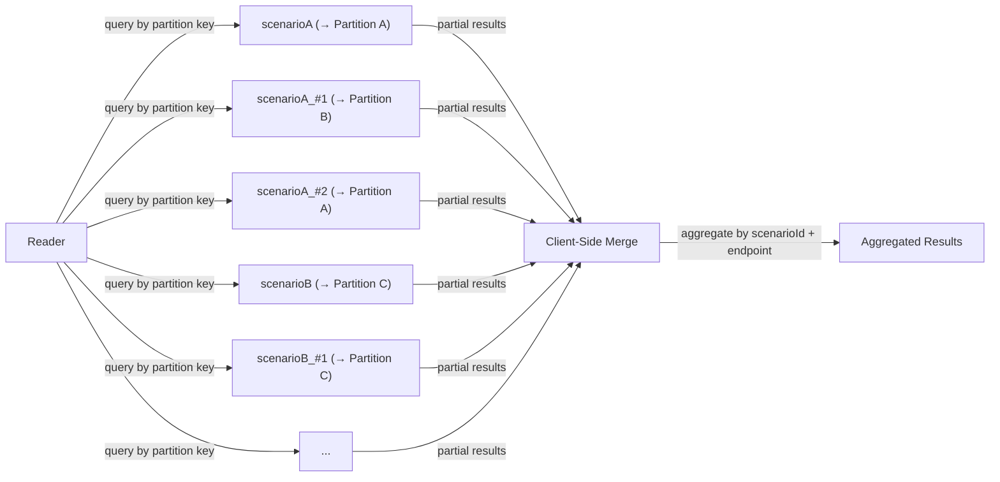
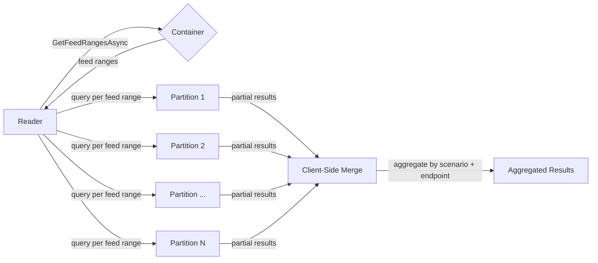

# Partition Key Allocation for Model Routing Requests

---

## 1. Problem Statement

The model routing system upserts a request document into the `modelRoutingRequests` Cosmos DB container (partition key: `/scenarioId`) when serving an inference request, and removes it upon completion (documents also carry a TTL of 300s as a safety net). Multiple scenarios share this container, each using synthetic partition keys with the format `scenarioId_#bucketId` (e.g., `responding-harmony-gpt51_#1`, `responding-harmony-gpt51_#2`). Each scenario's `bucketId` ranges from 0 to `BucketCount - 1` (default `BucketCount`: 1, max: 100). Bucket 0 uses the plain `scenarioId` as the partition key; buckets 1+ use the `_#bucketId` suffix.

Cosmos DB internally uses MurmurHash3 to map partition key strings to physical partitions. Sequential integer suffixes produce low-entropy hash inputs, causing **multiple logical partition keys to collide on the same physical partition**. Specifically, suffixes `_#2`, `_#6`, `_#7` all route to the same physical partition, stacking their RU consumption against a single physical partition's 10,000 RU/s limit and triggering **429 (TooManyRequests) throttling** even when the container's total provisioned throughput is far from exhausted.

### Current Partition Key Generation

**File:** `Shared/ModelRouting/Storage/Converters.cs` (line 35)

The current `GetPartitionKey` method produces keys by appending `_#{bucketId}` to the scenario ID. Bucket 0 uses the plain `scenarioId`; buckets 1 through `BucketCount - 1` use `{scenarioId}_#1` through `{scenarioId}_#{BucketCount - 1}`. The default `BucketCount` is 1 (max: 100), meaning by default only bucket 0 (the plain `scenarioId`) is used.

### Why This Fails

| Partition Key | MurmurHash3 → Physical Partition |
| ------------- | -------------------------------- |
| `scenario_#1` | Partition A                      |
| `scenario_#2` | **Partition B**                  |
| `scenario_#3` | Partition C                      |
| `scenario_#6` | **Partition B** ← collision      |
| `scenario_#7` | **Partition B** ← collision      |

Three keys landing on the same physical partition triple the RU load, leading to 429 throttling.

### Expected Physical Partition Utilization Under Random Distribution

Even with perfectly random partition key distribution, the [birthday problem](https://en.wikipedia.org/wiki/Birthday_problem) guarantees that not all physical partitions will be utilized. When _k_ keys are randomly distributed across _n_ physical partitions, the expected number of **occupied** partitions is:

$$E\lbrack\text{occupied}\rbrack = n \left(1 - \left(1 - \frac{1}{n}\right)^k\right)$$

For our system: **n = 100** physical partitions and **k = 51** total keys (the sum of each scenario's `BucketCount`):

$$E\lbrack\text{occupied}\rbrack = 100 \left(1 - \left(1 - \frac{1}{100}\right)^{51}\right) = 100 \left(1 - 0.99^{51}\right) \approx 100 \times 0.4017 = \mathbf{40.2}$$

| Metric | Value |
| ------ | ----- |
| Physical partitions (_n_) | 100 |
| Total logical keys (_k_) | 51 |
| Expected occupied partitions | **~40** (40.2%) |
| Expected empty partitions | **~60** (59.8%) |
| Effective utilization | **40%** |

**Implications:**

1. **Over half the physical partitions sit idle.** Even under ideal randomness, 51 keys across 100 partitions leave ~60 partitions completely empty — wasting provisioned throughput on partitions that serve zero traffic.

2. **Collisions are inevitable, not accidental.** With 51 keys and 100 partitions, the probability that **at least two keys collide** on the same partition is:

   $$P(\text{collision}) = 1 - \frac{100!}{100^{51} \cdot (100-51)!} \approx \mathbf{99.99\%}$$

   In expectation, ~11 keys will share a partition with at least one other key (51 keys − 40 occupied partitions = ~11 collisions), creating hot spots even with perfect randomness.

3. **Load is not uniform.** The occupied partitions absorb disproportionate load. With 51 keys across 40 partitions, the average occupied partition serves ~1.28 keys — but the distribution is uneven (some partitions serve 2–3+ keys while others serve exactly 1), creating RU imbalance.

4. **The problem worsens as keys grow.** If total keys increase (e.g., new scenarios added, higher `BucketCount`), collisions accelerate super-linearly while empty partitions shrink slowly — amplifying hot-partition risk.

### Minimum Keys Required for Full Partition Coverage

The previous section shows that 51 random keys cover only ~40 of 100 partitions. The inverse question — **how many random keys are needed to cover all _n_ partitions?** — is the classic [coupon collector's problem](https://en.wikipedia.org/wiki/Coupon_collector%27s_problem). The expected number of keys required is:

$$E\lbrack k_{\text{full}}\rbrack = n \cdot H(n) = n \sum_{i=1}^{n} \frac{1}{i}$$

where $H(n)$ is the _n_-th harmonic number. For **n = 100**:

$$E\lbrack k_{\text{full}}\rbrack = 100 \cdot H(100) \approx 100 \times 5.187 = \mathbf{519}$$

That is the _expected_ number — half the time it takes more. For a **99% probability** of covering all 100 partitions, the required key count is:

$$k_{99\text{\%}} \approx n \ln n + n \ln \frac{1}{\delta} = 100 \ln 100 + 100 \ln 100 \approx 100 \times 4.605 + 100 \times 4.605 = \mathbf{921}$$

where $\delta = 0.01$ is the failure probability.

| Target | Keys Required |
| ------ | ------------- |
| Cover all 100 partitions (expected) | **~519** |
| Cover all 100 partitions (99% probability) | **~921** |
| Current system total keys | **51** |
| Maximum possible keys (100 scenarios × 100 buckets) | **10,000** |
| Practical maximum keys (current scenarios) | **~100–200** |

**Why this matters:** Even if we could generate 519 keys, each key is a logical partition that the system must write to and query from — that is 519 concurrent queries per read sweep, far exceeding practical limits. The system is constrained to _k_ ≈ 51–200 total keys, an order of magnitude below the coupon collector threshold. Random hash distribution **cannot** achieve full partition coverage at any realistic key count.

**Conclusion:** Random hash distribution alone is insufficient. The probe-based approach proposed in this document solves this by **explicitly assigning** each logical key to a distinct physical partition, achieving `min(k, n)` occupied partitions — the theoretical maximum for a given key count. When _k ≥ n_, round-robin assignment ensures every partition is covered; when _k < n_, the system maximizes spread without generating synthetic keys beyond what scenarios require.

---

## Option 1: Random ID as Partition Key with Feed Range Queries (Picked)

### Summary

Use each document's randomly-generated `Id` (`PicassoId`) as the `/scenarioId` partition key value. Because `Id` is already random, MurmurHash3 distributes documents **uniformly across all physical partitions** with no additional infrastructure or coordination. The actual scenario name moves to a new `Scenario` field used for server-side aggregation (e.g., grouping by endpoint in `QueryUsageByPartition`).

#### Record Change

```csharp
internal sealed record LocalModelRoutingRequest(
    PicassoId Id,
    string ScenarioId,       // set to Id (random PicassoId — used as partition key)
    string Scenario,         // actual scenario name (e.g., "responding-harmony-gpt51")
    int Priority,
    string OwnerInstanceId,
    string? Endpoint,
    DateTimeOffset CreatedAt,
    int BucketId = 0,
    [property: JsonPropertyName("ttl")] int? TimeToLive = null);
```

#### How It Works

1. **Writer:** Sets `ScenarioId = Id`, giving every document a unique, random partition key. Sets `Scenario` to the actual scenario name for logical grouping.
2. **Reader:** Calls `Container.GetFeedRangesAsync()` to discover all physical partitions, then issues one query per feed range in parallel. Results are merged client-side and aggregated by `Scenario`. A **feed range** is a contiguous slice of the Cosmos DB hash ring that maps to exactly one physical partition.
3. **Bucket system eliminated** — each document has its own partition key, making `BucketId` / `BucketCount` unnecessary.

#### Data Flow — Before the Change




#### Reader Data Flow — After the Change




#### Migration

No container migration required — the `/scenarioId` partition key path is unchanged. Only the _value_ written to `scenarioId` changes:

| Phase | `ScenarioId` value | Reader behavior |
|-------|-------------------|-----------------|
| **Before** | `"responding-harmony-gpt51_#1"` (scenario + bucket) | Query by partition key per bucket |
| **After** | `"r8xrF2cKJ2hicdRUwSLCH"` (random ID) | Query all feed ranges concurrently |

### Pros

- **Near-zero complexity** — no new service, no probe algorithm, no allocation logic, no rollout state machine
- **Perfect distribution by construction** — random IDs guarantee uniform spread; no collisions possible
- **No container migration** — partition key path `/scenarioId` unchanged; only the value changes
- **Scales automatically** — works regardless of scenario count or physical partition topology changes
- **No coordination needed** — writers independently generate random IDs; no shared state or cross-replica consistency concerns

### Cons

- **Read fan-out** — every aggregation sweep issues _n_ parallel queries (one per feed range, currently 100), increasing aggregate RU cost. Physical partition count can be reduced after migration.
- **No single-partition point queries** — looking up a document requires the `Id`; scenario name alone is insufficient
- **Schema change** — requires a new `Scenario` field and updates to all writers/readers

### Coding Plan

Four PRs, deployed in order.

#### PR 1 — Add indexes for `Scenario` field

Add a composite index on `(/scenario ASC, /endpoint ASC)` to the `modelRoutingRequests` container. This is a metadata-only change — no application code, no document changes. Indexes build asynchronously; reads and writes are unaffected.

- Update indexing policy (Terraform):
  - Composite index: `["/scenario" ASC, "/endpoint" ASC]`

#### PR 2 — Writer: populate `Scenario` field

Add `Scenario` to the document model and populate it on every write. `ScenarioId` keeps the legacy bucket-based value — no behavior change yet.

- `Shared/ModelRouting/Storage/External/ModelRoutingRequest.cs` — add `Scenario` property
- `Shared/ModelRouting/Storage/Converters.cs` — set `Scenario` to the actual scenario name
- `Shared/ModelRouting/Storage/ModelRoutingStorageProvider.cs` — populate `Scenario` on upsert

After deployment: all new documents carry `Scenario`. Older documents lack the field, but the reader does not use it yet.

#### PR 3 — Reader: query by feed range

Replace per-bucket-key queries with feed-range-based concurrent queries across all physical partitions.

- `Shared/ModelRouting/Storage/ModelRoutingStorageProvider.cs`
    - Add two new functions GetQueuedRequestsByFeedRangesAsync and GetUsageByFeedRangesAsync, use `Container.GetFeedRangesAsync()`+ parallel per-feed-range queries
    - Follow the pattern await ModelRoutingRequests.ToListAsync in GetQueuedRequestsByFeedRangesCoreAsync and GetUsageByFeedRangesCoreAsync
- `Service.ModelRouting/Aggregator/ModelRoutingAggregator.cs`
    - Add an option in ModelRoutingOptions that it can switch between querying by partitions and querying by feed ranges, defualt value false, so when the change deployed, nothing changed
    - Add the switch within GetQueuedRequestsCoreAsync and GetUsageCoreAsync functions, don't change ProcessAggregationsCoreAsync

**Prerequisite:** PR 2 fully deployed across all regions (all documents must carry `Scenario`).

After deployment: the reader discovers documents regardless of `ScenarioId` value and aggregates by `Scenario` server-side. Compatible with both legacy and random-ID partition keys.

#### PR 4 — Writer: switch to random partition key

Set `ScenarioId = Id` so every document gets a unique, random partition key.

- `Shared/ModelRouting/Storage/Converters.cs` — set `ScenarioId = Id` in document conversion
- Remove or deprecate `BucketId` / `BucketCount` logic (no longer needed)
- Add an option to disable/enable this feature

**Prerequisite:** PR 3 fully deployed across all regions. The reader must already query by feed range; otherwise documents with random IDs would be invisible to legacy readers.

After deployment: writes distribute uniformly across all physical partitions.

## Option 2: Probe-Based Partition Key Allocation

### Summary

A dedicated **ModelRoutingControl** service would periodically probe Cosmos DB's metadata API, learn which synthetic suffixes (`scenarioId_#<hex4>`) land on which physical partitions, and build a deterministic allocation map. Each scenario bucket would then be assigned to a different physical partition with a greedy round-robin strategy to maximize spread and avoid hot spots.

Rollout would use a simple 2-state lifecycle: `active` during steady state, and `switching` during reallocation. In `switching`, writers move to the new keys while readers honor both the old and new allocations for a 30-second overlap window, preventing temporary data loss during the cutover. The resulting partition map would be stored in Cosmos DB and replicated across all 6 regions.


### Pros

- Precise partition control — places buckets deliberately instead of relying on hash luck
- Best possible spread for the current key count — reaches `min(k, n)` occupied partitions
- Self-correcting — periodic probes can detect partition splits and rebalance automatically

### Cons

- **High implementation complexity** — requires a new control-plane service, probing logic, allocation logic, and safe rollout semantics
- **More moving parts** — introduces a dedicated service and a persisted allocation map that must stay healthy and consistent
- **Higher operational cost** — adds monitoring, runbook ownership, and reallocation coordination across 6 regions