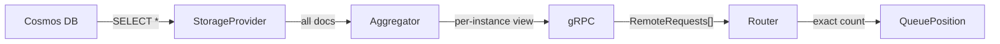
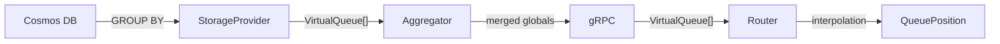

# Model Routing: Virtual Queue Design

## 1. Summary

A virtual queue is proposed to replace per-document tracking with **Cosmos DB server-side aggregation**. Instead of fetching every queued document individually and counting them across the pipeline, the virtual queue pushes aggregation down to Cosmos DB and returns only the summary statistics the router needs.

Today, the actual queue fetches every queued document:

```sql
-- Actual Queue: fetches every queued document
SELECT * FROM modelRoutingRequestsV2 r
WHERE NOT IS_DEFINED(r.endpoint) OR IS_NULL(r.endpoint)
```

The virtual queue replaces this with a `GROUP BY` that returns one summary row per `(scenarioId, priority)` group containing the count and time range:

```sql
-- Virtual Queue: returns aggregated statistics per group
SELECT r.scenarioId AS scenarioId,
       r.priority As priority,
       COUNT(1) AS queuedCount,
       MIN(r.createdAt) AS firstCreatedAt,
       MAX(r.createdAt) AS lastCreatedAt
FROM modelRoutingRequestsV2 r
WHERE NOT IS_DEFINED(r.endpoint) OR IS_NULL(r.endpoint)
GROUP BY r.scenarioId, r.priority
```

The router then estimates queue position via **time-based interpolation** — assuming requests are uniformly distributed over `[FirstCreatedAt, LastCreatedAt]` — instead of counting individual documents. The number of groups is small (scenarios x priority levels), bounded by configuration, and independent of queued requests count.

### Performance Impact

**Test setup:** VM with 4 cores, Cosmos DB with 8 physical partitions (feed ranges).

**Metrics used below:**
- **RU/FR/Query** — RU consumption per query per feed range. Measures the Cosmos DB cost of a single query execution against one physical partition.
- **Query latency** — total wall-clock time for concurrent queries across all 8 feed ranges. Measures how long the storage provider call takes end-to-end.

**Baseline at 60K items, 0% of requests queued (no queue):**

| Metric | Actual Queue | Virtual Queue |
|--------|-------------|---------------|
| **Query latency** | 13.83 ms | 14.82 ms |
| **RU/FR/Query** | 3.09 | 3.09 |

At zero queue depth both methods are equivalent — the `WHERE` filter eliminates all documents before aggregation, so `GROUP BY` adds negligible overhead.

**At 60K items, 10% of requests queued:**

| Metric | Actual Queue | Virtual Queue | Improvement |
|--------|-------------|---------------|-------------|
| **RU/FR/Query** | 20.91 | 9.48 | **-55%** |
| **Query latency** | 35.57 ms | 23.52 ms | **-34%** |

These savings **cascade through every layer of the system**: less data from Cosmos DB, less memory in the aggregator, smaller gRPC payloads, and O(groups) instead of O(documents) processing on the router side.

**Full performance comparison at 10% of requests queued across item counts:**

| Item Count | Avg Lat AQ (ms) | Avg Lat VQ (ms) | Latency Delta | RU/FR/Query AQ | RU/FR/Query VQ | RU Saving |
|---|---|---|---|---|---|---|
| 10K | 17.67 | 19.10 | -8.1% | 6.02 | 7.60 | -26.2% |
| 20K | 20.87 | 20.42 | +2.2% | 9.10 | 7.76 | 14.7% |
| 30K | 23.66 | 21.06 | +11.0% | 12.08 | 8.80 | 27.1% |
| 40K | 28.13 | 23.38 | +16.9% | 14.90 | 8.20 | 44.9% |
| 50K | 30.23 | 21.79 | +27.9% | 17.90 | 8.75 | 51.1% |
| 60K | 35.57 | 23.52 | +33.9% | 20.91 | 9.48 | 54.7% |
| 80K | 40.65 | 23.67 | +41.8% | 26.74 | 11.00 | 58.9% |
| 100K | 47.30 | 24.85 | +47.5% | 32.58 | 12.54 | 61.5% |

At small scale (10K), the `GROUP BY` overhead slightly exceeds the savings — VQ is ~8% slower and ~26% more expensive in RU. **The crossover point is ~20K items**, after which VQ wins on both latency and RU. The gains widen with scale: actual queue cost grows linearly with document count while virtual queue cost grows with the number of distinct groups (scenarios x priorities) and stays nearly flat. **The larger the queue, the greater the savings.**

### Tradeoff

The virtual queue model trades **exact queue position** for **approximate position via time-based interpolation**. This is acceptable because queue position is used for threshold checks (is capacity available?), not precise ranking. When requests arrive at a steady rate, they are evenly spread across the time range and the interpolation produces the exact position. When arrivals are bursty — for example, a spike of requests clustered near `LastCreatedAt` — the interpolation may overestimate or underestimate a request's position by a few slots. In practice this has minimal impact: the router only needs to know whether a request is "close enough to the front" to receive capacity, not its exact rank in the queue.

The virtual queue router uses the Cosmos-derived global snapshot as the single source of truth. It intentionally accepts snapshot lag for newly queued local requests in exchange for avoiding overlap/deduplication logic between local memory and the global aggregate.

---

## 2. Background

### System Architecture

The model routing system spans two services:

**Service.ModelRouting (Aggregator)** polls Cosmos DB every 30 ms, caches aggregated state, and serves per-instance views over gRPC.

**Inference Instances (ModelRouter)** poll the aggregator via gRPC, sync remote state, and allocate queued requests.

### Current Actual Queue Model

The aggregator fetches every queued document (`SELECT *`), sorts by `(ScenarioId, Priority, CreatedAt)`, and for each gRPC request builds per-instance `RemoteModelRoutingRequest` groups. The router stores these and uses exact counting for:

- **Queue position** — counts remote requests with higher priority or later timestamp
- **Queue-full** — sums remote request counts per scenario

### Problems with the Actual Queue Model

Today, the model routing system fetches **every queued request document** from Cosmos DB on every aggregation cycle — roughly every 30 ms. These documents flow through the entire pipeline: the aggregator sorts them and builds per-instance views, gRPC transfers them to every router instance, and each router counts them one-by-one to determine queue positions.

Every layer pays O(N) cost, where N is the number of queued documents:

| Layer | What Happens | Cost Driver |
|-------|-------------|-------------|
| **Cosmos DB** | `SELECT *` on all queued documents | RU scales linearly with queue depth |
| **Aggregator** | Caches all documents; rebuilds per-instance views per gRPC request | Memory and CPU scale with document count |
| **gRPC** | Transfers full document set to every router instance | Payload size scales with document count |
| **Router** | Stores documents per instance; scans for every queue position check | Memory and computation scale with document count |

The number of queued documents is **unbounded** and grows with load — exactly when the system can least afford the overhead.

---

## 3. Requirements

1. **Storage** — New `GetVirtualQueueByFeedRangesAsync` method on `IModelRoutingStorageProvider` returning aggregated virtual queue data
2. **Data model** — `VirtualQueue` record and `ModelRoutingAggregationsV2` carrying virtual queues instead of per-document data
3. **Aggregator** — `EnableVirtualQueueQuery` flag gates virtual queue fetch; new `GetAggregatedViewV2` serves cached V2 data
4. **gRPC** — New V2 endpoint serving virtual queue aggregations (no `instanceId` needed — virtual queues are instance-agnostic)
5. **Router** — Pluggable `IQueueCalculator` abstraction; `VirtualQueueCalculator` with time-based interpolation for queue position
6. **State** — `IModelRoutingState` gains `GlobalVirtualQueues` indexed by `(scenarioId, priority)` and `SyncGlobalState` method
7. **Runtime switch** — Three feature flags for incremental rollout and safe rollback via Azure App Configuration

---

## 4. Design

### 4.1 End-to-End Data Flow

**Actual Queue:**



**Virtual Queue:**



| Aspect | V1 | V2 |
|--------|----|----|
| Cosmos query | `SELECT *` (all docs) | `GROUP BY` (aggregates) |
| Data over gRPC | O(queued documents) | O(scenarios x priorities) |
| Per-instance view | Required | Not needed (instance-agnostic) |
| Queue position | Exact count | Time-based interpolation |

### 4.2 Router — Single `ModelRouter` with `IQueueCalculator`

Rather than forking the entire `ModelRouter` into a V2 variant, queue math is extracted into a pluggable `IQueueCalculator` interface:

```csharp
internal interface IQueueCalculator
{
    int GetQueuePosition(IModelRoutingState state, string scenarioId, int priority, DateTimeOffset createdAt);
    int GetQueuedCount(IModelRoutingState state, string scenarioId, bool isBackfill);
    string Mode { get; }
}
```

`ModelRouter` holds both `ActualQueueCalculator` and `VirtualQueueCalculator` and resolves the active one at runtime via `IOptionsMonitor<ModelRoutingWithAuthOptions>`. All lifecycle management, storage interactions, metrics, and allocation logic remain in one place. The version switch is isolated to queue-specific operations.

**`ActualQueueCalculator`** — preserves the existing exact-count logic using `RemoteModelRoutingRequests`.

**`VirtualQueueCalculator`** — uses `GlobalVirtualQueues` with time-based interpolation. The two core operations are queue position estimation and queue-full checking.

### 4.3 Virtual Queue Algorithm

**Queue Position (`GetQueuePosition`)** answers: "how many requests are ahead of me?" It combines two components:

**Step 1 — Count requests at strictly higher priority.** Iterate through priority levels in ascending order (lower value = higher priority). For each priority level above the request's own, look up the virtual queue for that `(scenarioId, priority)` and sum their `QueuedCount` values. Stop when reaching the request's own priority level.

**Step 2 — Estimate position within the same priority group.** Look up the virtual queue for the request's own `(scenarioId, priority)`. The interpolation direction depends on the queue ordering mode:

- **LIFO** (newer requests served first) — "how many requests were created *after* me?"
- **FIFO** (older requests served first) — "how many requests were created *before* me?"

The design supports both modes. This doc uses **LIFO as the example**. The algorithm handles boundary cases first, then interpolates the general case:

| Condition | LIFO Requests Ahead | Reasoning |
|-----------|---------------------|-----------|
| `createdAt >= LastCreatedAt` | 0 | Newest in the group — served first under LIFO |
| `createdAt < FirstCreatedAt` | `QueuedCount` | Older than everything — entire group is ahead |
| `createdAt == FirstCreatedAt` | `QueuedCount - 1` | Oldest in the group — everyone except self is ahead |
| Otherwise | interpolate (see below) | General case — interpolates time *after* the request |

**General-case interpolation (LIFO):** Assuming requests are uniformly distributed over `[FirstCreatedAt, LastCreatedAt]`, the fraction of the time range that falls *after* the request estimates how many requests were created after it:

```
lifoRequestsAhead = ceil( (LastCreatedAt - createdAt) / (LastCreatedAt - FirstCreatedAt) * QueuedCount )
```

For FIFO, invert the LIFO result:

```
fifoRequestsAhead = QueuedCount - lifoRequestsAhead - 1
```

**Final position** = 1 + (higher-priority count) + (same-priority requests ahead)

The `1 +` accounts for the request itself — position 1 means "next to be served."

**Worked example:** Scenario "gpt-4o", priority 2. The global snapshot contains:

| ScenarioId | Priority | QueuedCount | FirstCreatedAt | LastCreatedAt |
|------------|----------|-------------|----------------|---------------|
| gpt-4o | 0 | 5 | — | — |
| gpt-4o | 1 | 12 | — | — |
| gpt-4o | 2 | 100 | 10:00:00 | 10:10:00 |

A request with `createdAt = 10:07:00` at priority 2:
- Step 1: Higher-priority count = 5 (p=0) + 12 (p=1) = **17**
- Step 2: Time fraction after request = (10:10:00 - 10:07:00) / (10:10:00 - 10:00:00) = 3/10 = 0.3. Requests ahead at same priority = ceil(0.3 * 100) = **30**
- Position = 1 + 17 + 30 = **48**

Under V1 exact counting, this would require fetching and scanning all 117 documents. Under V2, it requires reading 3 virtual queue rows.

**Queue-Full (`GetQueuedCount`)** answers: "how many total requests are queued for this scenario?" It iterates through all priority levels, summing `QueuedCount` from each virtual queue matching the scenario. A backfill filter controls whether to count only backfill-priority requests or only non-backfill requests, matching V1's behaviour.

### 4.4 Design Constraints

The V2 calculator uses the Cosmos-derived global snapshot only — it does not add local in-memory queued requests on top, intentionally accepting snapshot lag to avoid overlap/deduplication complexity. Newly queued local requests become visible after their upsert is observed by the next aggregation snapshot.

### 4.5 Runtime Switch and Rollout

Three feature flags control incremental rollout, each independently togglable via Azure App Configuration (no restart needed):

| Stage | Flag | Component | Effect | Risk |
|-------|------|-----------|--------|------|
| 1 | `EnableVirtualQueueQuery` | Aggregator | Queries virtual queue from Cosmos DB, stores in memory | Low — read-only |
| 2 | `EnableVirtualQueueSync` | Router sync | Fetches and warms V2 state; routing still uses actual queue | Low/Medium — no decision change |
| 3 | `UseVirtualQueue` | Router | Switches live routing to virtual queue calculator | Medium — changes decisions |

Stage dependencies: 2 requires 1 (aggregator must have data), 3 requires 2 (V2 snapshot must be warm). Each can be rolled back independently by flipping the flag. Changes propagate within ~35 seconds.

**Rollback strategy:**

| Scenario | Action |
|----------|--------|
| V2 routing issues | `UseVirtualQueue = false` — instant revert to actual queue calculator |
| V2 sync issues | Disable `UseVirtualQueue`, then `EnableVirtualQueueSync` |
| Full rollback | All three flags to `false` — pure actual-queue behaviour |

### 4.6 Implementation Plan

5 phases delivered as separate PRs:

| Phase | PR Scope | Rollout |
|-------|----------|---------|
| **PR1** | Server-side V2 data plane (storage, aggregator, proto, gRPC endpoint) | Deploy dark, enable `EnableVirtualQueueQuery` in staging then prod |
| **PR2** | Refactor actual-queue path to split sync from allocation | Deploy, validate no behaviour change |
| **PR3** | Passive V2 inference snapshot path (client, state, background service dual-sync) | Deploy dark, enable `EnableVirtualQueueSync` in staging then prod |
| **PR4** | Live V2 queue-calculator switch (`IQueueCalculator`, both implementations, DI changes) | Deploy dark, enable `UseVirtualQueue` in staging then prod |
| **PR5** | Cleanup (remove V1 actual-queue code, flags, and inline V2 as the only path) | After sufficient production bake time |

---

## Key Decisions

| Decision | Rationale |
|----------|-----------|
| **Single router with pluggable `IQueueCalculator`** over separate V2 router | Most router code is shared (lifecycle, storage, metrics, allocation). Forking duplicates everything for a queue-math change. The `IQueueCalculator` abstraction isolates the only difference — queue position and queue-full computation — behind a clean interface. |
| **Global snapshot only** (no local request deduplication) | Avoids double-counting complexity. Accepts snapshot lag for newest local enqueues — an acceptable tradeoff since queue position is a threshold check, not a ranking. |
| **Time-based interpolation** over exact counting | O(groups) instead of O(documents). Exact under uniform distribution, degrades gracefully otherwise. Queue position only needs to be "correct enough" to determine capacity availability. |
| **Three-stage feature flags** | Enables independent validation at each layer. Each stage can bake in production before the next is enabled. Full rollback is a config change, not a deployment. |
