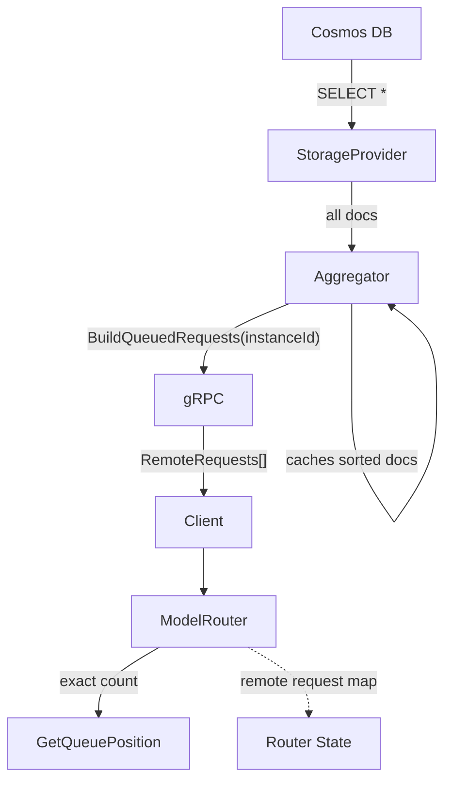
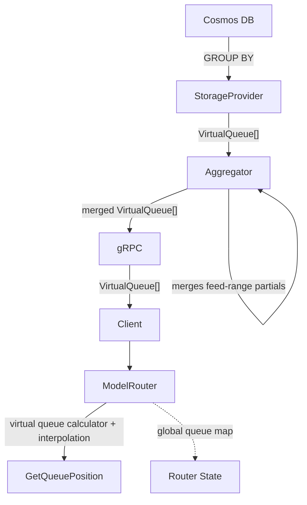

- Use branch lcao/mr_container_migration_3 in d:\Code\picasso as the baseline.

# Model Routing: Actual Queue to Virtual Queue Migration

## 1. Summary

Replace the actual per-document queue model with a virtual queue model across the entire model routing distributed system. Today the aggregator fetches every queued request document from Cosmos DB, sorts them, builds per-instance views, and sends individual `RemoteModelRoutingRequest` entries to each router instance via gRPC. The router uses these to compute exact queue positions.

The virtual queue model replaces this with server-side aggregation: Cosmos DB returns one `VirtualQueue` row per `(scenarioId, priority)` group containing the count and time range. The router estimates queue position via time-based interpolation against `FirstCreatedAt`/`LastCreatedAt` instead of counting individual remote entries.

This is an end-to-end change spanning four system boundaries:

1. **Storage** — new `GetVirtualQueueByFeedRangesAsync` on `IModelRoutingStorageProvider`
2. **Aggregator** — `EnableVirtualQueueQuery` flag gates virtual queue fetch in `ProcessAggregationsCoreAsync`; new `GetAggregatedViewV2` serves cached V2 data
3. **gRPC API** — new endpoint serving virtual queue aggregations
4. **Router** — existing `ModelRouter` gains pluggable `IQueueCalculator` implementations and can use a global virtual queue snapshot with time-based interpolation

At 60K items with 10% queue depth, the virtual queue query reduces RU/feed-range/request by ~55% and latency by ~34%. The reduction compounds across the system: less data transferred from Cosmos DB, less memory in the aggregator, smaller gRPC payloads, and O(groups) instead of O(documents) processing on the router side.

---

## 2. Background

### 2.1 Current System Architecture

The model routing system is distributed across two services:

**Service.ModelRouting (Aggregator Service):**
- `ModelRoutingAggregator` polls Cosmos DB every 30 ms via `IModelRoutingStorageProvider`
- Caches aggregated state in `ModelRoutingAggregationsCache`
- Serves per-instance views via gRPC (`GetModelRoutingAggregations`)

**Inference Service Instances (Router):**
- `ModelRoutingService` (BackgroundService) polls the aggregator via gRPC
- `ModelRoutingAggregationsClient` deserializes the gRPC response into `ModelRoutingAggregations`
- `ModelRouter.ProcessAggregationsAndAllocate` syncs remote state and allocates queued requests

Data flow:
```
Cosmos DB → ModelRoutingStorageProvider → ModelRoutingAggregator → gRPC → ModelRoutingAggregationsClient → ModelRouter → ModelRoutingState
```

### 2.2 Current Actual Queue Model

The aggregator fetches **every queued document** from Cosmos DB:

```sql
SELECT * FROM modelRoutingRequestsV2 r
WHERE NOT IS_DEFINED(r.endpoint) OR IS_NULL(r.endpoint)
```

The aggregator then:
1. Sorts all documents by `(ScenarioId, Priority, CreatedAt)`
2. For each gRPC request, runs `BuildAggregatedQueuedRequests(instanceId, sortedDocuments)` to produce per-instance `RemoteModelRoutingRequest` groups (own requests act as group boundaries)

The router stores these as `FrozenDictionary<string, IReadOnlyList<RemoteModelRoutingRequest>>` keyed by scenarioId and uses them in:
- **`GetQueuePosition`** — counts remote requests with higher priority or earlier timestamp
- **`GetQueuedCount`** — sums remote request counts per scenario for queue-full checks

### 2.3 Problems with the Actual Queue Model

| Problem | Impact |
|---------|--------|
| **O(N) data transfer** | Every queued document is fetched from Cosmos DB, transferred over gRPC, and stored in each router instance's memory. Cost scales linearly with queue depth. |
| **Per-instance view computation** | `BuildAggregatedQueuedRequests` runs once per gRPC request. Each router instance triggers a full scan of all cached documents. |
| **Memory pressure** | The aggregator holds all queued documents in `ModelRoutingAggregationsCache.SortedQueuedRequests`. Under load, this can be tens of thousands of objects. |
| **RU cost** | `SELECT *` fetches full documents when only aggregate statistics are needed. RU scales linearly with document count. |

### 2.4 Virtual Queue Model

The virtual queue model replaces per-document tracking with aggregate statistics:

```sql
SELECT
    r.scenarioId, r.priority,
    COUNT(1) AS queuedCount,
    MIN(r.createdAt) AS firstCreatedAt,
    MAX(r.createdAt) AS lastCreatedAt
FROM modelRoutingRequestsV2 r
WHERE NOT IS_DEFINED(r.endpoint) OR IS_NULL(r.endpoint)
GROUP BY r.scenarioId, r.priority
```

Each `VirtualQueue(ScenarioId, Priority, QueuedCount, FirstCreatedAt, LastCreatedAt)` summarizes one `(scenarioId, priority)` group. In V2, the router uses this Cosmos-derived global snapshot as the sole source of truth for queue-full and queue-position checks; it does not add local in-memory queued requests on top of the aggregate. This intentionally accepts snapshot lag for newly queued local requests in exchange for avoiding overlap/reconciliation logic between local memory and the global aggregate.

The router estimates queue position via time-based interpolation rather than exact counting:

- If `createdAt >= LastCreatedAt` → 0 requests ahead (newest, served first under LIFO)
- If `createdAt <= FirstCreatedAt` → all requests ahead (oldest, served last under LIFO)
- Otherwise → interpolate assuming uniform distribution over `[FirstCreatedAt, LastCreatedAt]`

This trades exact position for O(groups) data transfer and computation. In practice the number of groups is small (number of scenarios × number of priority levels) and bounded by configuration, while the number of documents is unbounded.

### 2.5 Performance Comparison

**Actual Queue (QR) vs Virtual Queue (VQ) at 60K Items:**

| Scenario | Avg Latency (ms) | RU/FR/req |
|---|---|---|
| QR Q=0%  | 13.83 | 3.09  |
| VQ Q=0%  | 14.82 | 3.09  |
| QR Q=10% | 35.57 | 20.91 |
| VQ Q=10% | 23.52 | 9.48  |

At zero queue depth both methods are equivalent — the `WHERE` filter eliminates all documents before aggregation, so `GROUP BY` adds negligible overhead. Under 10% queue load, VQ reduces latency by ~34% and RU/FR/req by ~55% compared to QR.

**Performance data at 10% queue depth across item counts (8 feed ranges):**

| Item Count | Avg Lat QR (ms) | Avg Lat VQ (ms) | Latency Delta | RU/FR/req QR | RU/FR/req VQ | RU Saving |
|---|---|---|---|---|---|---|
| 10K | 17.67 | 19.10 | -8.1% | 6.02 | 7.60 | -26.2% |
| 20K | 20.87 | 20.42 | +2.2% | 9.10 | 7.76 | 14.7% |
| 30K | 23.66 | 21.06 | +11.0% | 12.08 | 8.80 | 27.1% |
| 40K | 28.13 | 23.38 | +16.9% | 14.90 | 8.20 | 44.9% |
| 50K | 30.23 | 21.79 | +27.9% | 17.90 | 8.75 | 51.1% |
| 60K | 35.57 | 23.52 | +33.9% | 20.91 | 9.48 | 54.7% |
| 80K | 40.65 | 23.67 | +41.8% | 26.74 | 11.00 | 58.9% |
| 100K | 47.30 | 24.85 | +47.5% | 32.58 | 12.54 | 61.5% |

QR cost scales linearly with document count; VQ cost scales with the number of distinct groups and grows much more slowly.

---

## 3. Requirements

1. **New storage method** — `GetVirtualQueueByFeedRangesAsync` on `IModelRoutingStorageProvider`.
2. **New data model** — `VirtualQueue` record and `ModelRoutingAggregationsV2` carrying virtual queues instead of per-document queued requests.
3. **Aggregator V2 path** — `EnableVirtualQueueQuery` flag in `ProcessAggregationsCoreAsync` gates virtual queue fetch; new `GetAggregatedViewV2` on `IModelRoutingAggregator` serves cached V2 data.
4. **gRPC V2 endpoint** — new RPC serving virtual queue aggregations to router instances.
5. **Virtual queue calculator** — `ModelRouter` consuming a global virtual queue snapshot through `VirtualQueueCalculator` with time-based interpolation for queue position.
6. **State model update** — `IModelRoutingState` gains `GlobalVirtualQueues` and `SyncGlobalState(ModelRoutingAggregationsV2)`.
7. **Runtime switch** — Three feature flags (`EnableVirtualQueueQuery`, `EnableVirtualQueueSync`, `UseVirtualQueue`) for incremental rollout and safe rollback via Azure App Configuration.

---

## 4. Design

### 4.1 Data Models

**`VirtualQueue` (internal):**

```csharp
namespace Picasso.ModelRouting;

internal sealed record VirtualQueue(
    string ScenarioId,
    int Priority,
    int QueuedCount,
    DateTimeOffset FirstCreatedAt,
    DateTimeOffset LastCreatedAt);
```

**`VirtualQueue` (external, Cosmos DB deserialization):**

```csharp
namespace Picasso.ModelRouting.Storage.External;

internal sealed record VirtualQueue(
    string ScenarioId,
    int Priority,
    int QueuedCount,
    DateTimeOffset FirstCreatedAt,
    DateTimeOffset LastCreatedAt);
```

**`ModelRoutingAggregationsV2`:**

```csharp
namespace Picasso.ModelRouting;

internal sealed record ModelRoutingAggregationsV2(
    IReadOnlyList<VirtualQueue> VirtualQueues,
    IReadOnlyList<ScenarioUsage> ScenariosUsage,
    IReadOnlyList<EndpointUsage> EndpointsUsage);
```

Replaces `ModelRoutingAggregations.QueuedRequests` (list of `RemoteModelRoutingRequest`) with `VirtualQueues` (list of `VirtualQueue`). The usage fields are unchanged.

### 4.2 Storage Layer

**`IModelRoutingStorageProvider` — add method:**

```csharp
Task<IReadOnlyList<VirtualQueue>> GetVirtualQueueByFeedRangesAsync(CancellationToken cancellationToken);
```

**`ModelRoutingStorageProvider` — add query and implementation:**

```csharp
private const string QueryVirtualQueueByFeedRange = """
    SELECT
        r.scenarioId AS scenarioId,
        r.priority AS priority,
        COUNT(1) AS queuedCount,
        MIN(r.createdAt) AS firstCreatedAt,
        MAX(r.createdAt) AS lastCreatedAt
    FROM modelRoutingRequestsV2 r
    WHERE NOT IS_DEFINED(r.endpoint) OR IS_NULL(r.endpoint)
    GROUP BY r.scenarioId, r.priority
    """;

private static readonly QueryDefinition VirtualQueueByFeedRangeQueryDefinition = new(QueryVirtualQueueByFeedRange);

[Activity("Cosmos.GetVirtualQueueByFeedRanges", Owner.ModelRouting)]
private async Task<IReadOnlyList<VirtualQueue>> GetVirtualQueueByFeedRangesCoreAsync(CancellationToken cancellationToken)
{
    var container = ModelRoutingRequests;
    var feedRanges = await container.GetFeedRangesAsync(cancellationToken);

    var virtualQueueArrays = await feedRanges.WhenAllAsync(
        (feedRange, ct) => container.ToListAsync<External.VirtualQueue>(feedRange, VirtualQueueByFeedRangeQueryDefinition, FeedRangeRequestOptions, ct),
        cancellationToken);

    return virtualQueueArrays.SelectMany(static vq => vq).Select(Converters.ToInternal).ToArray();
}
```

**`Converters` — add mapping:**

```csharp
internal static VirtualQueue ToInternal(this External.VirtualQueue virtualQueue) =>
    new(
        virtualQueue.ScenarioId,
        virtualQueue.Priority,
        virtualQueue.QueuedCount,
        virtualQueue.FirstCreatedAt,
        virtualQueue.LastCreatedAt);
```

**`SerializationContext` — add:**

```csharp
[JsonSerializable(typeof(External.VirtualQueue))]
```

### 4.3 Aggregator

Add `EnableVirtualQueueQuery` check inside the existing `ProcessAggregationsCoreAsync`. When the flag is true, the aggregator additionally fetches virtual queue data from Cosmos DB and stores it in `cachedAggregationsV2`. The original aggregation path is unchanged.

**`IModelRoutingAggregator` — add V2 method:**

```csharp
internal interface IModelRoutingAggregator
{
    ModelRoutingAggregations GetAggregatedView(string instanceId);        // existing
    ModelRoutingAggregationsV2 GetAggregatedViewV2();                     // new
    Task ProcessAggregationsAsync(CancellationToken cancellationToken);   // existing
}
```

**Add `IOptionsMonitor<ModelRoutingOptions>` to constructor and `GetAggregatedViewV2Core`:**

```csharp
internal sealed partial class ModelRoutingAggregator(
    ILogger<ModelRoutingAggregator> logger,
    Metrics metrics,
    IModelRoutingStorageProvider modelRoutingStorageProvider,
    IOptionsMonitor<ModelRoutingOptions> options)   // new
    : IModelRoutingAggregator
{
    private volatile ModelRoutingAggregationsCache cachedAggregations = new([], [], []);
    private volatile ModelRoutingAggregationsCacheV2 cachedAggregationsV2 = new([], [], []);  // new

    [Activity("ModelRouting.GetAggregatedViewV2", Owner.ModelRouting)]
    private ModelRoutingAggregationsV2 GetAggregatedViewV2Core()
    {
        var cache = cachedAggregationsV2;
        return new(cache.VirtualQueues, cache.ScenariosUsage, cache.EndpointsUsage);
    }
```

**Update `ProcessAggregationsCoreAsync`:**

```csharp
[Activity("ModelRouting.ProcessAggregations", Owner.ModelRouting)]
private async Task ProcessAggregationsCoreAsync(CancellationToken cancellationToken)
{
    var enableVirtualQueueQuery = options.CurrentValue.EnableVirtualQueueQuery;

    var getQueuedRequestsTask = GetQueuedRequestsAsync(cancellationToken);
    var getUsageTask = GetUsageAsync(cancellationToken);
    var getVirtualQueuesTask = enableVirtualQueueQuery
        ? GetVirtualQueuesAsync(cancellationToken)
        : null;

    var queuedRequests = await getQueuedRequestsTask;
    var (scenariosUsage, endpointsUsage) = await getUsageTask;

    cachedAggregations = new(queuedRequests, scenariosUsage, endpointsUsage);

    if (getVirtualQueuesTask is not null)
    {
        var virtualQueues = await getVirtualQueuesTask;
        cachedAggregationsV2 = new(virtualQueues, scenariosUsage, endpointsUsage);
    }

    ReportAggregatorMetrics(scenariosUsage, endpointsUsage);
}
```

**Add `GetVirtualQueuesAsync`:**

```csharp
private async Task<IReadOnlyList<VirtualQueue>> GetVirtualQueuesAsync(CancellationToken cancellationToken)
{
    var virtualQueues = await modelRoutingStorageProvider.GetVirtualQueueByFeedRangesAsync(cancellationToken);

    // Merge partial results from different feed ranges for the same (scenarioId, priority) group
    return virtualQueues
        .GroupBy(static vq => (vq.ScenarioId, vq.Priority))
        .Select(static g => new VirtualQueue(
            g.Key.ScenarioId,
            g.Key.Priority,
            g.Sum(static vq => vq.QueuedCount),
            g.Min(static vq => vq.FirstCreatedAt),
            g.Max(static vq => vq.LastCreatedAt)))
        .ToArray();
}
```

Note: feed-range queries return partial results per physical partition. The same `(scenarioId, priority)` group may appear in multiple feed ranges and must be merged — sum `QueuedCount`, min `FirstCreatedAt`, max `LastCreatedAt`.

**Add `ModelRoutingAggregationsCacheV2`:**

```csharp
internal sealed record ModelRoutingAggregationsCacheV2(
    IReadOnlyList<VirtualQueue> VirtualQueues,
    IReadOnlyList<ScenarioUsage> ScenariosUsage,
    IReadOnlyList<EndpointUsage> EndpointsUsage);
```

`ModelRoutingAggregationsCache` is unchanged. The V2 cache reuses the same `ScenariosUsage` and `EndpointsUsage` from each polling cycle but replaces the per-request queue data with aggregated `VirtualQueues`. When `EnableVirtualQueueQuery` is `false`, `cachedAggregationsV2` is not refreshed. It remains empty until the first successful V2 fetch, and after that it retains the last successful V2 snapshot unless the implementation explicitly clears it.

### 4.4 gRPC API

**New RPC in `modelrouting.proto`:**

```protobuf
message VirtualQueue {
  string scenarioId = 1;
  int32 priority = 2;
  int32 queuedCount = 3;
  google.protobuf.Timestamp firstCreatedAt = 4;
  google.protobuf.Timestamp lastCreatedAt = 5;
}

message GetModelRoutingAggregationsV2Request {
}

message GetModelRoutingAggregationsV2Response {
  repeated VirtualQueue virtualQueues = 1;
  repeated ScenarioUsage scenariosUsage = 2;
  repeated EndpointUsage endpointsUsage = 3;
}

service ModelRouting {
  // Existing
  rpc GetModelRoutingAggregations (GetModelRoutingAggregationsRequest) returns (GetModelRoutingAggregationsResponse);
  // New — no instanceId needed since virtual queues are instance-agnostic
  rpc GetModelRoutingAggregationsV2 (GetModelRoutingAggregationsV2Request) returns (GetModelRoutingAggregationsV2Response);
}
```

**`ModelRoutingService` (gRPC server) — add handler:**

```csharp
public override Task<External.GetModelRoutingAggregationsV2Response> GetModelRoutingAggregationsV2(
    External.GetModelRoutingAggregationsV2Request request, ServerCallContext context)
{
    var aggregations = modelRoutingAggregator.GetAggregatedViewV2();
    return Task.FromResult(ToExternal(aggregations));
}
```

Same pattern as the existing gRPC endpoint — reads from the volatile `cachedAggregationsV2` snapshot populated by `ProcessAggregationsCoreAsync`.

### 4.5 Router — single `ModelRouter` with `IQueueCalculator`

Keep a single `ModelRouter` implementing `IModelRouter` and `IRequestAllocationManager`. The router continues to own acquire/release, queued request allocation, cleanup loops, storage writes, and usage/logging. The only V1/V2 difference that moves out of the router is queue math: queue position and queue-full calculation.

This avoids the main downside of a separate V2 router implementation: most router code is shared, so forking the entire class duplicates lifecycle management, storage interactions, metrics/logging, and allocation flow for what is fundamentally a queue-math change. It also avoids scattering `if (UseVirtualQueue)` across the whole router. The version switch is isolated to the queue-specific operations.

**New abstraction:**

```csharp
internal interface IQueueCalculator
{
    int GetQueuePosition(IModelRoutingState state, string scenarioId, int priority, DateTimeOffset createdAt);
    int GetQueuedCount(IModelRoutingState state, string scenarioId, bool isBackfill);
    string Mode { get; }
}
```

`ModelRouter` holds both calculators and resolves the active one from an `IOptionsMonitor<ModelRoutingWithAuthOptions>`:

```csharp
public ModelRouter(
    ...,
    [FromKeyedServices("ActualQueue")] IQueueCalculator actualQueueCalculator,
    [FromKeyedServices("VirtualQueue")] IQueueCalculator virtualQueueCalculator,
    IOptionsMonitor<ModelRoutingWithAuthOptions> optionsMonitor)
{
    this.actualQueueCalculator = actualQueueCalculator;
    this.virtualQueueCalculator = virtualQueueCalculator;
    this.optionsMonitor = optionsMonitor;
}

private IQueueCalculator CurrentQueueCalculator =>
    optionsMonitor.CurrentValue.UseVirtualQueue ? virtualQueueCalculator : actualQueueCalculator;
```

Acquire and allocation stay unchanged structurally; they call `CurrentQueueCalculator.GetQueuePosition(...)` and `CurrentQueueCalculator.GetQueuedCount(...)` at the decision points where the queue model matters. This keeps concurrency and cleanup logic in one place and preserves one set of telemetry event names. Logs and metrics can add a structured dimension such as `queueMode=actual|virtual` instead of creating duplicate V2-specific events.

**`ActualQueueCalculator`:**
- Uses `RemoteModelRoutingRequests` and the existing exact counting logic.
- Preserves current queue position and queue-full behaviour.

**`VirtualQueueCalculator`:**
- Uses `GlobalVirtualQueues` and time-based interpolation.
- Uses the Cosmos-derived global snapshot only; it does not add local in-memory queued requests on top.
- Intentionally accepts snapshot lag for newly queued local requests in exchange for avoiding overlap/reconciliation logic.

**Queue position estimation — time-based interpolation:**

The core algorithmic change is in `GetGlobalNumberOfRequestsAhead`. Without individual documents, the router cannot count exact queued requests ahead. Instead it interpolates against the global time range. The method accesses `state` (the `IModelRoutingState` passed to the calculator via `GetQueuePosition`):

```csharp
private int GetGlobalNumberOfRequestsAhead(string scenarioId, int priority, DateTimeOffset createdAt)
{
    // PriorityValues: static pre-computed array of all priority int values ordered ascending,
    // e.g. [0, 1, 2, 3, 4, 5, 6]. Defined as a shared constant on the calculator.
    // Count all queued requests with strictly higher priority (lower priority value)
    int globalRequestsWithHigherPriority = 0;
    foreach (int p in PriorityValues)
    {
        if (p >= priority)
            break;

        if (state.GlobalVirtualQueues.TryGetValue((scenarioId, p), out var virtualQueue))
            globalRequestsWithHigherPriority += virtualQueue.QueuedCount;
    }

    if (!state.GlobalVirtualQueues.TryGetValue((scenarioId, priority), out var priorityQueue))
        return globalRequestsWithHigherPriority;

    // Interpolate within the same priority group assuming uniform distribution (LIFO — newer requests served first)
    int requestsAheadAtSamePriority = createdAt switch
    {
        // Newest request in the group — no one ahead at this priority (served first under LIFO)
        _ when createdAt >= priorityQueue.LastCreatedAt => 0,

        // Older than everything in the group — everyone in the group is ahead
        _ when createdAt < priorityQueue.FirstCreatedAt => priorityQueue.QueuedCount,

        // Exactly at FirstCreatedAt — this request is itself the oldest in the group,
        // so everyone except itself is ahead
        _ when createdAt == priorityQueue.FirstCreatedAt => priorityQueue.QueuedCount - 1,

        // Single-element group where First == Last but createdAt doesn't match either
        // (shouldn't happen in practice, but guards against division by zero)
        _ when priorityQueue.FirstCreatedAt == priorityQueue.LastCreatedAt => 0,

        // General case: linearly interpolate position within the time range.
        // Under LIFO, requests created *after* this one are ahead, so we measure
        // the fraction of the time range that falls after createdAt.
        _ => Math.Min(
            priorityQueue.QueuedCount - 1,
            (int)Math.Ceiling(
                1.0 * (priorityQueue.LastCreatedAt - createdAt).Ticks
                    / (priorityQueue.LastCreatedAt - priorityQueue.FirstCreatedAt).Ticks
                    * priorityQueue.QueuedCount))
    };

    return globalRequestsWithHigherPriority + requestsAheadAtSamePriority;
}
```

The interpolation assumes LIFO ordering (newer requests are served first, so older requests have more requests ahead of them), matching V1's `GetQueuePosition` which counts remotes where `r.CreatedAt > createdAt`. The fraction `(LastCreatedAt - createdAt) / (LastCreatedAt - FirstCreatedAt)` estimates what proportion of queued requests were created after the current request. This is an approximation — it's exact when requests are uniformly distributed and degrades gracefully when they're not, because the queue position only needs to be correct enough to determine if capacity is available (a threshold check, not a ranking).

In V2, queue position is derived from the global snapshot only:

```csharp
private int GetQueuePosition(string scenarioId, int priority, DateTimeOffset createdAt) =>
    1 + GetGlobalNumberOfRequestsAhead(scenarioId, priority, createdAt);
```

This intentionally does not add local queued requests that are not yet visible in Cosmos DB. Newly queued local requests become visible to V2 queue math after their upsert is observed by the next aggregation snapshot.

**Queue-full check:**

```csharp
private int GetQueuedCount(string scenarioId, bool isBackfill)
{
    var globalQueuedCount = 0;
    foreach (int p in PriorityValues)
    {
        if (isBackfill != (p == BackfillPriorityInt))
            continue;

        if (state.GlobalVirtualQueues.TryGetValue((scenarioId, p), out var virtualQueue))
            globalQueuedCount += virtualQueue.QueuedCount;
    }

    return globalQueuedCount;
}
```

This is the simplest reconciliation rule: V2 queue-full checks use the same lagging global snapshot as queue position. That avoids double-counting local requests already reflected in Cosmos DB, at the cost of delayed visibility for the newest local enqueues.

The important design point is that these algorithms live in `VirtualQueueCalculator`, not in a second full router class.

### 4.6 `IModelRoutingState` Changes

Add virtual queue support alongside existing fields:

```csharp
internal interface IModelRoutingState : IDisposable
{
    // ... existing members ...

    // New: Global virtual queues indexed by (scenarioId, priority)
    FrozenDictionary<(string ScenarioId, int Priority), VirtualQueue> GlobalVirtualQueues { get; }

    // New: Sync from V2 aggregations
    void SyncGlobalState(ModelRoutingAggregationsV2 aggregations);
}
```

**`ModelRoutingState.SyncGlobalState`:**

```csharp
public void SyncGlobalState(ModelRoutingAggregationsV2 aggregations)
{
    // Build virtual queue lookup from aggregation
    var newGlobalVirtualQueues = aggregations.VirtualQueues
        .ToFrozenDictionary(
            vq => (vq.ScenarioId, vq.Priority),
            vq => vq);

    GlobalVirtualQueues = newGlobalVirtualQueues;

    // Convert lists to dictionaries for O(1) lookup (matching V1's pattern)
    var scenarioUsageLookup = aggregations.ScenariosUsage
        .ToDictionary(s => s.ScenarioId, StringComparer.Ordinal);
    var endpointUsageLookup = aggregations.EndpointsUsage
        .ToDictionary(e => e.Endpoint, StringComparer.Ordinal);

    // Update scenario and endpoint usage (same as V1)
    ScenarioUsages = ScenarioUsages.Keys.ToFrozenDictionary(
        scenarioId => scenarioId,
        scenarioId => scenarioUsageLookup.GetValueOrDefault(scenarioId, new(scenarioId, 0, 0)),
        StringComparer.Ordinal);

    EndpointUsages = EndpointUsages.Keys.ToFrozenDictionary(
        endpoint => endpoint,
        endpoint => endpointUsageLookup.GetValueOrDefault(endpoint, new(endpoint, 0)),
        StringComparer.Ordinal);
}
```

### 4.7 `ModelRoutingAggregationsClient` Changes

**`IModelRoutingAggregationsClient` — add V2 method:**

```csharp
internal interface IModelRoutingAggregationsClient
{
    Task<ModelRoutingAggregations> GetAggregatedStateAsync(PicassoId instanceId, CancellationToken cancellationToken);  // existing
    Task<ModelRoutingAggregationsV2> GetAggregatedStateV2Async(CancellationToken cancellationToken);                    // new
    Task<IEnumerable<ModelRoutingConfig>> GetModelRoutingConfigsAsync(CancellationToken cancellationToken);              // existing
}
```

**Add V2 client implementation:**

Note: `ModelRoutingAggregationsV2` in the inference namespace (`Picasso.Inference.ModelRouting`) uses `IReadOnlyList` fields — matching the aggregator-side pattern since virtual queues are already keyed by `(ScenarioId, Priority)` and the dictionary conversion happens in `IModelRoutingState.SyncGlobalState`.

```csharp
public async Task<ModelRoutingAggregationsV2> GetAggregatedStateV2Async(CancellationToken cancellationToken)
{
    var aggregations = await modelRoutingGrpcClient.GetModelRoutingAggregationsV2Async(
        new(),
        deadline: timeProvider.GetGrpcCallDeadline(TimeSpan.FromSeconds(5)),
        cancellationToken: cancellationToken);

    var virtualQueues = aggregations.VirtualQueues.Select(ToInternalVirtualQueue).ToArray();
    var scenariosUsage = aggregations.ScenariosUsage.Select(ToInternal).ToArray();
    var endpointsUsage = aggregations.EndpointsUsage.Select(ToInternal).ToArray();

    return new(virtualQueues, scenariosUsage, endpointsUsage);
}

private static VirtualQueue ToInternalVirtualQueue(Picasso.ModelRouting.Api.External.VirtualQueue entry) =>
    new(entry.ScenarioId, entry.Priority, entry.QueuedCount, entry.FirstCreatedAt.ToDateTimeOffset(), entry.LastCreatedAt.ToDateTimeOffset());
```

### 4.8 `ModelRoutingService` (BackgroundService) Changes

The background service on each inference instance syncs state through `IRequestAllocationManager` (resolved to `ModelRouter`). To support safe cutover, sync and allocation are split: the service always refreshes the actual-queue snapshot, optionally refreshes the virtual-queue snapshot when `EnableVirtualQueueSync` is enabled, and runs allocation once through the same router instance. The V2 sync path is best-effort while `UseVirtualQueue` is `false`, so a V2 fetch failure must not suppress actual-queue allocation. Once `UseVirtualQueue` is `true`, the router continues using the last successful V2 snapshot if a later V2 fetch fails. Change from `IOptions` to `IOptionsMonitor` to support runtime flag toggling without restart:

```csharp
protected override async Task ExecuteAsync(CancellationToken stoppingToken)
{
    logger.Starting();
    do
    {
        try
        {
            var aggregations = await aggregationsClient.GetAggregatedStateAsync(requestManager.InstanceId, stoppingToken);
            requestManager.SyncAggregations(aggregations);

            if (options.CurrentValue.EnableVirtualQueueSync)
            {
                try
                {
                    var aggregationsV2 = await aggregationsClient.GetAggregatedStateV2Async(stoppingToken);
                    requestManager.SyncAggregationsV2(aggregationsV2);
                }
                catch (Exception ex) when (ex.IsNotCancelled())
                {
                    logger.FailedToSyncV2(ex);
                }
            }

            requestManager.AllocateQueuedRequests();

            var configs = await aggregationsClient.GetModelRoutingConfigsAsync(stoppingToken);
            configClient.UpdateModelRoutingConfiguration(configs.ToArray());
        }
        catch (Exception ex) when (ex.IsNotCancelled())
        {
            logger.FailedToProcess(ex);
        }
    }
    while (await processingTimer.WaitForNextTickAsync(stoppingToken));

    logger.Stopping();
}
```

### 4.9 Runtime Switch

Three feature flags control incremental rollout, each gated independently via Azure App Configuration (already supported by the Picasso repo). Toggling any flag takes effect within the refresh interval — no deployment or restart needed.

Flags are split across options classes matching their consumers:

**`ModelRoutingOptions`** (aggregator-side, `Picasso.ModelRouting`):

```csharp
internal sealed record ModelRoutingOptions
{
    // ... existing properties ...

    // Stage 1: Aggregator fetches virtual queue data from Cosmos DB and holds it in memory.
    //          The original aggregation path is unaffected.
    public bool EnableVirtualQueueQuery { get; init; }
}
```

**`ModelRoutingWithAuthOptions`** (inference-side, `Picasso.Inference.ModelRouting`):

```csharp
internal sealed record ModelRoutingWithAuthOptions
{
    // ... existing properties ...

    // Stage 2: Background service fetches and warms the V2 snapshot, but routing still uses ActualQueueCalculator.
    public bool EnableVirtualQueueSync { get; init; }

    // Stage 3: ModelRouter switches from ActualQueueCalculator to VirtualQueueCalculator.
    public bool UseVirtualQueue { get; init; }
}
```

**Rollout order:**

| Stage | Flag | Component | Effect | Risk |
|-------|------|-----------|--------|------|
| 1 | `EnableVirtualQueueQuery` | Aggregator | Queries virtual queue from Cosmos DB, stores in memory. Existing actual-queue aggregation is unchanged. | Low — read-only, no downstream impact |
| 2 | `EnableVirtualQueueSync` | Router background sync | Fetches and warms V2 state on every sync cycle, but live decisions still use `ActualQueueCalculator`. | Low/Medium — extra gRPC and memory, no decision change |
| 3 | `UseVirtualQueue` | Router | Switches `ModelRouter` from the actual-queue calculator to the virtual-queue calculator after both snapshots are warm. | Medium — changes routing decisions |

Each stage can be enabled independently and rolled back by flipping the flag. Stage 2 depends on stage 1 being active (the aggregator must have virtual queue data for the V2 gRPC endpoint to serve). Stage 3 depends on stage 2 being active so the V2 snapshot is already warm before live routing switches to it. Stage 1 can run safely without stages 2 and 3, and stage 2 can run safely without stage 3.

**DI registration** — keep a single non-keyed `ModelRouter` as both `IModelRouter` and `IRequestAllocationManager`, and add keyed queue-calculator implementations:

```csharp
// Queue calculator registrations
services
    .AddKeyedSingleton<IQueueCalculator, ActualQueueCalculator>("ActualQueue")
    .AddKeyedSingleton<IQueueCalculator, VirtualQueueCalculator>("VirtualQueue")
    .AddKeyedSingleton<IModelRouter, WeightedModelRouter>("WeightedModelRouter");

services.AddSingleton<ModelRouter>();
services.AddSingleton<IModelRouter>(sp => sp.GetRequiredService<ModelRouter>());
services.AddSingleton<IRequestAllocationManager>(sp => sp.GetRequiredService<ModelRouter>());
```

`ModelRouter` constructor adds both queue-calculator implementations plus `IOptionsMonitor<ModelRoutingWithAuthOptions>`, and selects the active calculator at runtime. No delegating wrapper is required.

**`ModelRoutingLeaseFactory` change** — resolve non-keyed `IModelRouter` so the lease path follows the live queue-calculator choice inside `ModelRouter`:

```csharp
// Before: [FromKeyedServices("ModelRouter")] IModelRouter modelRouter
// After:
internal sealed partial class ModelRoutingLeaseFactory(
    ...
    IModelRouter modelRouter) : IModelRoutingLeaseFactory   // resolves to ModelRouter
```

**`IRequestAllocationManager` — split sync from allocation:**

```csharp
internal interface IRequestAllocationManager
{
    PicassoId InstanceId { get; }
    void SyncAggregations(ModelRoutingAggregations aggregations);      // actual-queue snapshot
    void SyncAggregationsV2(ModelRoutingAggregationsV2 aggregations);  // virtual-queue snapshot
    void AllocateQueuedRequests();                                     // router-owned allocation loop; queue math comes from IQueueCalculator
}
```

**`ModelRouter` integration points** — one router owns all lifecycle and delegates only queue math:

```csharp
internal sealed partial class ModelRouter : IModelRouter, IRequestAllocationManager, IAsyncDisposable
{
    private IQueueCalculator CurrentQueueCalculator =>
        optionsMonitor.CurrentValue.UseVirtualQueue ? virtualQueueCalculator : actualQueueCalculator;

    public void SyncAggregations(ModelRoutingAggregations aggregations)
    {
        state.SyncWithRemoteState(aggregations);
        ReportAggregatedUsageMetrics(aggregations);
    }

    public void SyncAggregationsV2(ModelRoutingAggregationsV2 aggregations) =>
        state.SyncGlobalState(aggregations);

    private int GetQueuePosition(string scenarioId, int priority, DateTimeOffset createdAt) =>
        CurrentQueueCalculator.GetQueuePosition(state, scenarioId, priority, createdAt);

    private int GetQueuedCount(string scenarioId, bool isBackfill) =>
        CurrentQueueCalculator.GetQueuedCount(state, scenarioId, isBackfill);
}
```

This keeps rollout safety, but avoids a second full router class and preserves one set of logs, activities, and cleanup behavior.

**Rollback strategy:** Roll back in reverse order by flipping flags in Azure App Configuration. Changes propagate within ≤ 35 seconds (30s refresh interval + up to 5s jitter) — no deployment, no restart.

| Scenario | Action |
|----------|--------|
| V2 routing issues | Set `UseVirtualQueue = false` — reverts live decisions to the actual-queue calculator immediately while `EnableVirtualQueueSync` can stay enabled to keep the V2 snapshot warm for retry. |
| V2 sync issues | Set `UseVirtualQueue = false`, then set `EnableVirtualQueueSync = false` — stops fetching V2 state on inference instances and returns to V1-only sync. |
| Virtual queue fetch issues (e.g., RU spike) | Set `UseVirtualQueue = false`, set `EnableVirtualQueueSync = false`, then set `EnableVirtualQueueQuery = false` — disables V2 in reverse dependency order. The last successful V2 snapshot may remain cached in memory, so this is safe only when V2 consumers are also disabled or the cache is explicitly cleared. |
| Full rollback | Set all three flags to `false` — system returns to pure actual-queue behaviour. |

---

## 5. System Data Flow Comparison

### V1 (Actual Queue)



### V2 (Virtual Queue)



Key differences:

| Aspect | V1 | V2 |
|--------|----|----|
| Cosmos query | `SELECT *` (all docs) | `GROUP BY` (aggregates) |
| Data over gRPC | O(queued documents) | O(scenarios × priorities) |
| Aggregator cache | All sorted documents | Merged global virtual queues in `cachedAggregationsV2` |
| Per-instance view | Required (`BuildAggregatedQueuedRequests`) | Not needed (virtual queues are instance-agnostic) |
| Queue position | Exact count | Time-based interpolation |
| State structure | `IReadOnlyList<RemoteModelRoutingRequest>` per scenario | Global `VirtualQueue` per (scenario, priority) |

---

## 6. Files Changed

### New Files

| File | Description |
|------|-------------|
| `Shared/ModelRouting/VirtualQueue.cs` | `VirtualQueue` internal record |
| `Shared/ModelRouting/Storage/External/VirtualQueue.cs` | `External.VirtualQueue` Cosmos DB serialization record |
| `Shared/ModelRouting/ModelRoutingAggregationsCacheV2.cs` | `ModelRoutingAggregationsCacheV2` record (or added to existing `ModelRoutingAggregations.cs`) |
| `Shared/ModelRouting/ModelRoutingAggregationsV2.cs` | `ModelRoutingAggregationsV2` record (or added to existing `ModelRoutingAggregations.cs`) |
| `Shared/Inference/ModelRouting/IQueueCalculator.cs` | Queue-calculator abstraction for V1/V2 queue math |
| `Shared/Inference/ModelRouting/ActualQueueCalculator.cs` | Existing exact-count queue calculator used by `ModelRouter` |
| `Shared/Inference/ModelRouting/VirtualQueueCalculator.cs` | V2 virtual-queue calculator with time-based interpolation |

### Modified Files

| File | Change |
|------|--------|
| `Shared/ModelRouting/Storage/IModelRoutingStorageProvider.cs` | Add `GetVirtualQueueByFeedRangesAsync` |
| `Shared/ModelRouting/Storage/ModelRoutingStorageProvider.cs` | Add query constant, `QueryDefinition`, and implementation |
| `Shared/ModelRouting/Storage/Converters.cs` | Add `ToInternal` for `External.VirtualQueue` |
| `Shared/ModelRouting/Storage/External/SerializationContext.cs` | Add `[JsonSerializable(typeof(External.VirtualQueue))]` |
| `Service.ModelRouting/InternalContracts/IModelRoutingAggregator.cs` | Add `GetAggregatedViewV2` |
| `Service.ModelRouting/Aggregator/ModelRoutingAggregator.cs` | Add `GetAggregatedViewV2Core`, `GetVirtualQueuesAsync`, `EnableVirtualQueueQuery` check in `ProcessAggregationsCoreAsync` |
| `Service.ModelRouting/Api/Services/ModelRoutingService.cs` | Add `GetModelRoutingAggregationsV2` gRPC handler |
| `Service.ModelRouting/Api/Proto/ModelRouting.proto` | Add `VirtualQueue` message, V2 request/response messages, and V2 RPC |
| `Shared/Inference/ModelRouting/IModelRoutingState.cs` | Add `GlobalVirtualQueues` and `SyncGlobalState(ModelRoutingAggregationsV2)` |
| `Shared/Inference/ModelRouting/ModelRoutingState.cs` | Implement `GlobalVirtualQueues` storage and `SyncGlobalState` |
| `Shared/Inference/ModelRouting/IModelRoutingAggregationsClient.cs` | Add `GetAggregatedStateV2Async` and inference-side `ModelRoutingAggregationsV2` record |
| `Shared/Inference/ModelRouting/ModelRoutingAggregationsClient.cs` | Add V2 client method and `ToInternalVirtualQueue` mapper |
| `Shared/Inference/ModelRouting/IRequestAllocationManager.cs` | Split sync from allocation (`SyncAggregations`, `SyncAggregationsV2`, `AllocateQueuedRequests`) |
| `Shared/Inference/ModelRouting/ModelRouter.cs` | Keep single router; delegate queue math to `IQueueCalculator` and remove duplicated V2 lifecycle/logging code |
| `Shared/Inference/ModelRouting/ModelRoutingService.cs` | Change `IOptions` to `IOptionsMonitor`, always sync V1, optionally sync V2 behind `EnableVirtualQueueSync`, then allocate once |
| `Shared/ModelRouting/ModelRoutingOptions.cs` | Add `EnableVirtualQueueQuery` flag |
| `Shared/Inference/ModelRouting/ModelRoutingWithAuthOptions.cs` | Add `EnableVirtualQueueSync` and `UseVirtualQueue` flags |
| `Shared/Inference/ModelRouting/ModelRoutingLeaseFactory.cs` | Change `[FromKeyedServices("ModelRouter")] IModelRouter` to non-keyed `IModelRouter` |
| `Shared/Inference/AppStartup.cs` | Register `ActualQueueCalculator`, `VirtualQueueCalculator`, and non-keyed `ModelRouter` |

---

## 7. Migration Plan

Implement in rollout-safe PRs so each deployed phase has a single clear purpose and production behaviour stays stable until prerequisites are already deployed and warmed.

### Phase/PR1 — Server-side V2 Readonly Data Plane

Scope:
- Add `VirtualQueue`, `ModelRoutingAggregationsV2`, `GetVirtualQueueByFeedRangesAsync`, feed-range merge logic, `cachedAggregationsV2`, proto changes, and the V2 gRPC endpoint.
- Keep `EnableVirtualQueueQuery = false` by default.

Rollout:
1. Deploy with all flags `false`
2. Enable `EnableVirtualQueueQuery` in staging
3. Validate RU, latency, gRPC payload size, and V2 endpoint health
4. Enable `EnableVirtualQueueQuery` in production

### Phase/PR2 — Actual-Queue Refactor To Split Sync From Allocation

Scope:
- Refactor `IRequestAllocationManager`, `ModelRouter`, and `ModelRoutingService` so the actual-queue path uses `SyncAggregations(...)` followed by `AllocateQueuedRequests()`.
- Do not introduce live virtual-queue calculator behavior in this PR.

Rollout:
1. Deploy with no flag change
2. Validate that actual-queue behavior remains identical

### Phase/PR3 — Passive V2 Inference Snapshot Path

Scope:
- Add inference-side `ModelRoutingAggregationsV2`, `GetAggregatedStateV2Async`, `GlobalVirtualQueues`, `SyncGlobalState`, `EnableVirtualQueueSync`, and the background-service dual-sync path.
- Constraint: when `UseVirtualQueue = false`, V2 fetch/sync must be best-effort and must not block actual-queue allocation if it fails.

Rollout:
1. Deploy with `EnableVirtualQueueSync = false`
2. Enable `EnableVirtualQueueSync` in staging
3. Validate V2 fetch health and memory/cpu overhead while allocation still follows `ActualQueueCalculator`
4. Enable `EnableVirtualQueueSync` in production

### Phase/PR4 — Live V2 Queue-Calculator Switch

Scope:
- Add `IQueueCalculator`, `ActualQueueCalculator`, `VirtualQueueCalculator`, `ModelRouter` refactor, DI registration changes, and `UseVirtualQueue`.
- Constraint: depends on PR3 already being deployed and `EnableVirtualQueueSync = true`.

Rollout:
1. Deploy with `UseVirtualQueue = false`
2. Enable `UseVirtualQueue` in staging
3. Validate queue position behaviour, queue-full behaviour, allocation behaviour, queue-depth overshoot, RU reduction, and rollback
4. Enable `UseVirtualQueue` in production

### Phase/PR5 — Cleanup

Scope:
1. Remove `ActualQueueCalculator`
2. Remove `GetQueuedRequestsByFeedRangesAsync` from `IModelRoutingStorageProvider` and implementation
3. Remove `BuildAggregatedQueuedRequests` from aggregator
4. Remove `GetAggregatedView(instanceId)`, `ModelRoutingAggregationsCache`, and V1 gRPC endpoint
5. Remove `RemoteModelRoutingRequests` from `IModelRoutingState`
6. Remove `SyncWithRemoteState(ModelRoutingAggregations)` from state
7. Remove `EnableVirtualQueueQuery`, `EnableVirtualQueueSync`, and `UseVirtualQueue` flags
8. Inline `VirtualQueueCalculator` as the only queue implementation if the extra abstraction is no longer needed, and rename `ModelRoutingAggregationsCacheV2` → `ModelRoutingAggregationsCache`

Rollout:
1. Only after sufficient production bake time on V2
2. Only after rollback is no longer required

### Rollback Order

Flip flags in reverse dependency order via Azure App Configuration. Changes propagate within ≤ 35 seconds — no deployment and no restart needed.

1. `UseVirtualQueue = false`
2. `EnableVirtualQueueSync = false`
3. `EnableVirtualQueueQuery = false`

---

## 8. Testing

### Unit Tests

**Storage:**
- `ModelRoutingStorageProvider.GetVirtualQueueByFeedRangesAsync`: verify feed-range fan-out and conversion.
- `Converters.ToInternal(External.VirtualQueue)`: verify field mapping.

**Aggregator:**
- `ModelRoutingAggregator.GetVirtualQueuesAsync`: verify feed-range merging (sum counts, min/max timestamps for same group across feed ranges).
- `GetAggregatedViewV2Core`: verify returns snapshot from `cachedAggregationsV2`.
- `ProcessAggregationsCoreAsync` with `EnableVirtualQueueQuery = true`: verify `cachedAggregationsV2` is populated.
- `ProcessAggregationsCoreAsync` with `EnableVirtualQueueQuery = false`: verify `cachedAggregationsV2` is not refreshed; before first V2 fetch it remains empty, and after a prior successful V2 fetch it retains the last snapshot unless explicitly cleared.

**VirtualQueueCalculator:**
- `GetGlobalNumberOfRequestsAhead` interpolation:
  - `createdAt` after `LastCreatedAt` → returns 0 (newest, served first under LIFO)
  - `createdAt` before `FirstCreatedAt` → returns full `QueuedCount` (oldest, everyone ahead)
  - `createdAt` at midpoint → returns ~half of `QueuedCount`
  - Single-element queue (`FirstCreatedAt == LastCreatedAt`) with `createdAt` matching → returns 0
  - Single-element queue with `createdAt` not matching the timestamp → returns 0 (guards against division by zero in interpolation)
- `GetQueuePosition`: verify it is derived from the global snapshot only and does not add local queued requests on top.
- `GetQueuedCount(scenarioId, isBackfill)`: verify it returns the global queued count with correct backfill filtering.
- Empty virtual queue (no queued requests): `GetQueuePosition` returns 1 (only self) and `GetQueuedCount` returns 0.
- Visibility lag scenario: a newly queued local request that is not yet present in the global snapshot should not affect V2 queue position or queue-full checks until the next successful sync.
- Existing `ModelRouter` allocation tests still pass when `UseVirtualQueue = true`.

**ActualQueueCalculator:**
- Existing `ModelRouter` exact-count queue position and queue-full tests remain unchanged.

**ModelRouter queue-calculator selection:**
- `SyncAggregations` updates actual-queue state regardless of `UseVirtualQueue`.
- `SyncAggregationsV2` updates virtual-queue state regardless of `UseVirtualQueue`.
- When `UseVirtualQueue = true`, allocation decisions reflect queue position and queued-count values from `VirtualQueueCalculator`.
- When `UseVirtualQueue = false`, allocation decisions reflect queue position and queued-count values from `ActualQueueCalculator`.
- Runtime flag change switches calculators on the next call without requiring router re-creation.

**Background service:**
- `EnableVirtualQueueSync = false` → actual-queue snapshot is refreshed, V2 fetch is skipped, and allocation runs once.
- `EnableVirtualQueueSync = true` → actual-queue and virtual-queue snapshots are both refreshed, and allocation still runs exactly once.
- V2 fetch failure while `UseVirtualQueue = false` → actual-queue allocation still runs for that tick.
- V2 fetch failure while `UseVirtualQueue = true` → allocation continues using the last successful V2 snapshot.

### Staging Validation

- Virtual queue results match expected aggregation from the actual queue query.
- RU reduction consistent with benchmarks.
- Queue position estimation produces allocation behaviour comparable to the existing exact-count path under normal load.
- No 429 throttling.
- gRPC payload size reduction measurable.
